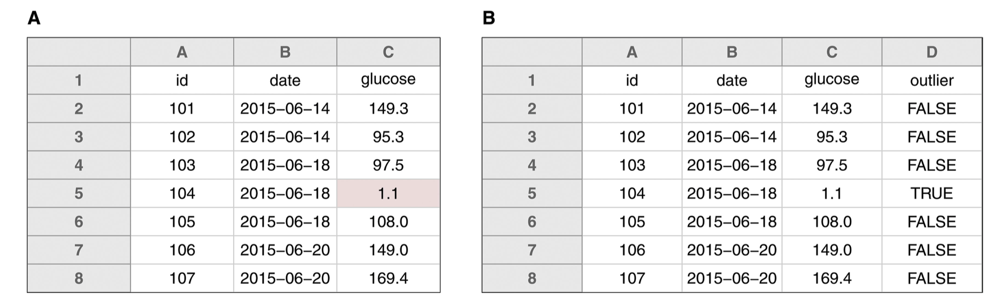

```{r xaringan-themer, include = FALSE, warning = FALSE}
library(xaringanthemer)
library(magrittr)
style_mono_accent(
  base_color = "#09274B",
  base_font_size = "32px", 
  header_h1_font_size = "2.0rem",
  header_h2_font_size = "1.5rem",
  header_h3_font_size = "1.25rem", 
  header_background_content_padding_top = "2rem", 
  header_font_google = google_font("Lato"),
  text_font_google   = google_font("Montserrat", "300", "300i", "500"),
  code_font_google   = google_font("Source Code Pro"), 
  extra_css = list("p" = list("margin-block-start" = "0.5em", 
                              "margin-block-end" = "0.5em"), 
                   "ul" = list("margin-block-start" = "0.5em", 
                              "margin-block-end" = "0.5em"), 
                   "li" = list("margin-block-start" = "0.5em", 
                              "margin-block-end" = "0.5em"), 
                   "pre" = list("margin-top" = "0.5em", 
                              "margin-bottom" = "0.5em"),
                   ".caption" = list("display" = "none"),
                   ".compact-table" = list("font-size" = "0.5rem")), 
  link_color = "#339944"
)
```

class: inverse, center, middle

# `r desc::desc_get('Title', '..')`
### `r rmarkdown::metadata$author`
### `r rmarkdown::metadata$institute`
### (updated: `r Sys.Date()`)

---
class: inverse, center, middle

# Campus Resources

---
# Academic Research Consulting & Services

https://arcs.uflib.ufl.edu/

Consultation and Guidance on Doing Research:
* data management
* open access (and NIH Public Access Policy)
* data science and GIS
* HiPerGator access for student research (without other funding)

---
# UF Research Computing

https://www.rc.ufl.edu/get-started/

### HiPerGator
* UF super computer, including nVidia GPUs for machine learning

### ResVault
* secure computing environment for working with restricted and confidential data

---
# Data Science / Computing at UF

[UF Carpentries](https://www.uf-carpentries.org/) offers short workshops on basic computing skills.

[UF R-Gators](http://www.r-gators.com/) affinity club for R users

[Stats Courses](https://ufstatscourses.shinyapps.io/shiny_tutorial/) - schedule of stats courses at UF, maintained by Denis Valle

---
# Motivating Scenarios

--

1. You finished your paper draft and 3 weeks later your PI wants you to change one of the figures from a scatterplot to a histogram.

--
2. You submitted your paper and 3 months later, reviewers want a secondary analysis to check some property of the data.

--
3. You graduated and 3 years layer, you are writing a grant that will combine your data from a past project with what you are working on now.

---

# Why be organized?

* Make it easy to switch between projects.
* Be confident that your results are correct.  
  (or if not correct, at least you know **how** you got your results)
* Work more effectively with others.
  (including yourself in the future)
* Share your data and results with others.  
  (soon to be required as part of [Nelson 2022 OSTP memo](https://www.whitehouse.gov/ostp/news-updates/2022/08/25/ostp-issues-guidance-to-make-federally-funded-research-freely-available-without-delay/))

---

# Learning Outcomes

By the end of the workshop, participants will be able to:

`r gsub("\n ", "\n", desc::desc_get("learningOutcomes"))`

---
class: inverse, center, middle

# File and Folder Organization

---

# Principles

* Don't spend time looking for stuff.
* Be consistent in keeping files associated with a project in **one** folder.

--
### Why a folder?

* A folder can store multiple files and sub-folders.
* A folder is the basic unit for setting shared permissions on e.g. Google Drive / GitHub / Dropbox

---
# What to include in your project folder

* project `README`
* data (or as little instructions as needed to get the data)
* code
* figures
* manuscript

---

# The `README`

* summary of the project & goals (the why)
* guidance for how to use the project (the how)
  - datasets, results, paper file
* who did the experiments
* formatting of the data
* funding acknowledgments / how to cite

---

# Structuring a Project Folder

<pre class = "hljs remark-code">
project/
├── data/
├── figures/
├── output/
├── paper/
├── R/
└── README.md
</pre>

--
* more examples in [Marwick et al. 2018 "Packaging Data Analytical Work Reproducibly Using R (and Friends)"](https://www.tandfonline.com/doi/abs/10.1080/00031305.2017.1375986)

---
# Summary

* keep **information about the project**  
  in the same place as the **files**
* store important details for later usage
  - e.g. writing a conference abstract
  - make it easy for teammates to help
  - make it easy for your PI to find things

---
class: inverse, center, middle

# Naming Things

---

# Principles

* You will have LOTS of files.
* You don't want to spend time opening them to find the right one.
  - for a specific subset of data
  - for a specific bit of code
  - to make changes in just the right spot

---

# Examples (NOT SO GOOD)

<pre class = "hljs remark-code">
Hao's data with spaces & punctuation.xlsx
01.R
figure 1.png
fig 2.jpg
report-final FINAL HY-comments ver3.docx
</pre>

---

# Examples (BETTER)

<pre class = "hljs remark-code">
hao_learned_about_underscores.xlsx
01_import-data.R
fig01_scatterplot_length-vs-interest.png
fig02_histogram_talk-attendance.png
yearly-report_2020-06-01_hy-comments.docx
</pre>

---
# Machine-Readable

* Avoid spaces, punctuation, accented characters, mixing upper and lowercase.
  - some computers don't distinguish between `README` and `readme` (others do!)
  - simpler names are easier to remember
* Separate words with hyphens `'-'`
* Separate groupings with underscores `'_'`

---

# Human-Readable

* Filenames do not need to be 100% thorough
* Filenames *should* help you find it later when you need to
* For code, use nouns for data objects and verbs for actions:
  - `load-data.R`
  - `data_mtcars.csv`
  - `make-scatterplot.R`

---

# Using Default Ordering

* Files are usually sorted alphabetically
  - we can make use of this!
* Left-pad with numbers to impose an order on files:
  - e.g. `01_load-data.R`, `02_process-data.R`
* Use RFC-3339 for dates:
  - `YYYY-MM-DD` format (alphabetical sorting makes it chronological, too!)

---

# Example

<pre class = "hljs remark-code">
siteA_2020-04-01_animal-count.xls
siteA_2020-05-01_animal-count.xls
siteB_2020-04-01_animal-count.xls
siteB_2020-04-01_weather.dat
siteB_2020-05-01_animal-count.xls
siteB_2020-05-01_weather.dat
</pre>

--

filename format:

` {site}_{date}_{type of data} `

---

# Summary

Choose names for file that:
* don't cause issues for computer
* are descriptive for humans
* sort nicely

Be consistent! (at least within an individual project)

---
class: inverse, center, middle

# Structuring Tabular Data (e.g. spreadsheets)

---

# Principles

Make it easy for anyone to work with your data:
* Structure data for analysis (i.e. "Tidy Data")
* Don't use text-formatting to store information!
* Keep a copy of raw data for reproducibility
* Include a Data Dictionary

---

# Tidy Data

Properties of *tidy data*:
* each column is a variable
* each row is an observation
* each table is a single observational unit

---

# Common issues

* storing data values in column headers
  - e.g. treatment values, dates of sampling
* storing variables in rows
  - when adding more data, you should only increase # of rows  
    (the columsn are fixed)
* keeping too much data in one table
  - e.g. different types of measurements

---

# Example: column labels encoding data

* wide-format data

|name|Thin Mints|Samoas|Tagalongs|
|--|--|--|--|
|A|4|0|0|
|B|2|0|2|
|c|0|3|1|

---

# Example: re-structured columns

* long-format data

|name|flavor|boxes|
|--|--|--|
|A|Thin Mints|4|
|B|Thin Mints|2|
|B|Tagalongs|2|
|C|Samoas|3|
|C|Tagalongs|1|

---

# Example: multiple observational units

|name|address|flavor|boxes|
|--|--|--|--|
|A|3828 Piermont Dr|Thin Mints|4|
|B|221B Baker St|Thin Mints|2|
|B|221B Baker St|Tagalongs|2|
|C|124 Conch St|Samoas|3|
|C|124 Conch St|Tagalongs|1|

---

# Example: separate tables

.pull-left[
|name|flavor|boxes|
|--|--|--|
|A|Thin Mints|4|
|B|Thin Mints|2|
|B|Tagalongs|2|
|C|Samoas|3|
|C|Tagalongs|1|
]

.pull-right[
|name|address|
|--|--|
|A|3828 Piermont Dr|
|B|221B Baker St|
|C|124 Conch St|
]

---
# Spreadsheet Formatting

* for missing data, use empty cells or `'NA'`
  - *be careful about `'NA'` for certain types of data (e.g. country code for "Namibia")*
* do NOT space out data with empty rows/columns
* do NOT use text formatting (e.g. bold/italics) to store information
* WATCH OUT: Excel LOVES to convert data into a date format

---
# Example: spreadsheet formatting

```{r, echo = FALSE, fig.cap = "Figure 10 from Broman & Woo \"Data Organization in Spreadsheets\", showing a data table with an outlier highlighted in red as an example of bad formatting, and then an alternative where the outlier status is encoded in its own column."}

```

Instead of highlighting the cells with outliers, encode outlier status as its own column.

---

# Data Files

* store raw data for reproducibility
  - save a separate cleaned-up version
  - and/or use scripts to clean/wrangle raw data
* document processing steps in code or text
  - someone else can reproduce your data workflow
  - OpenRefine is a great tool for cleaning messy data (and records the steps for you)!  
  https://uf-repro.github.io/OpenRefine-intro/

---

# Data Dictionary

* define your rows and columns
  - e.g. Are the rows ...
     + individual subjects
     + OR data collection sessions
     + OR individual samples from a measurement device
* define codes, categories, acronyms
* define relationships between multiple tables

---

# Example Data Dictionary

.compact-table[
|name|plot_name|group|description|type|
|--|--|--|--|--|
|mouse|Mouse|demographic|Animal identifier|text|
|sex|Sex|demographic|Male (M) or Female (F)|factor|
|sac_date|Date of sac|demographic|Date mouse was sacrificed|date|
|partial_inflation|Partial inflation|clinical|Indicates if mouse showed partial pancreatic inflation|logical|
|coat_color|Coat color|demographic|Coat color, by visual inspection|factor|
|crumblers|Crumblers|clinical|Indicates if mouse stored food in their bedding|logical|
|diet_days|Days on diet|clinical|Number of days on high-fat diet|numeric|
]

(modified from Figure 9 of Broman & Woo "Data Organization in Spreadsheets")

---
class: inverse, center, middle

# Sharing Data

---
# Principles

* data sharing is becoming more standardized
  - to be required by most Federal funders (if not already)
* data sharing IS extra work
  - but much less if you are already organized
  - doing it WELL can increase your impact  
    (other researchers can use it, or build collaborations based on shared use of data)

---
# FAIR

* Guidelines for *Scientific Data*
  (but which also apply to other outputs)
  - Findable
  - Accessible
  - Interoperable
  - Reusable

---
# Findable

* Can humans and machines find the data?
  - use metadata that *describes* the content
  - use metadata that helps people *find* it
  
--

**Metadata** is data that describes or gives information about other data

e.g. _hashtags_ indicate that a tweet is about a particular subject (such as a conference), and enable others to easily find many tweets about that subject

---
# Accessible

* there should be minimal barriers
  - e.g. no proprietary interfaces or software required
  - share your data in a dedicated repository
* use established methods to authenticate access to protected or private data

---
# DOI = Digital Object Identifier

* format
  - `10.NNNN/{suffix}`
  - `NNNN` identifies the registrant
  - `{suffix}` identifies the object
  - e.g. `10.5281/zenodo.3892183`
---
# DOI Properties

* DOIs are permanent
  - the object and metadata record are archived
* unambiguous
  - each DOI links to a unique object, and will only ever link to that object


---
# Interoperable

* use a common, shared file format
* use a data standard for organizing and structuring data
  - it is possible that no such standard exists for your field!
* use a metadata standard for attributes
  - e.g. [Ecological Metadata Language](https://eml.ecoinformatics.org/)

---
# Reusable

* help researchers identify whether it is suitable for their usage
* use a legal license that enables re-use
  - e.g. CC-BY or CC-0
  - **don't use a code license**, e.g. MIT
* include attribution and a description of how to cite the data

---
# FREE Repositories

* Zenodo - https://zenodo.org/
* figshare - https://figshare.com
* OSF - https://osf.io/

### Maybe free if covered by a journal
* Dryad - https://datadryad.org

---
# GitHub

GitHub is a platform designed primarily for collaborative open source software development.

* Many researchers use it to store data or research projects, and to collaborate!  
  https://uf-repro.github.io/friendly-github-intro/ 

* GitHub is not **archival**.
  - No guarantee for continued free access
  - The owner of the data or code could change it, move it, or delete it 

---
# Summary

When in doubt, look at example publications in your field!

* What keywords did they use?
* How did they structure the data?
  - if the data is not tidy, you don't have to follow along
  - using the same or similar column labels could be effective

---

# Thanks

* Contact me for additional questions or consultation requests.
  - haoye@ufl.edu
* Check my libguide for other lesson materials.
  - https://guides.uflib.ufl.edu/reproducibility/lessons
